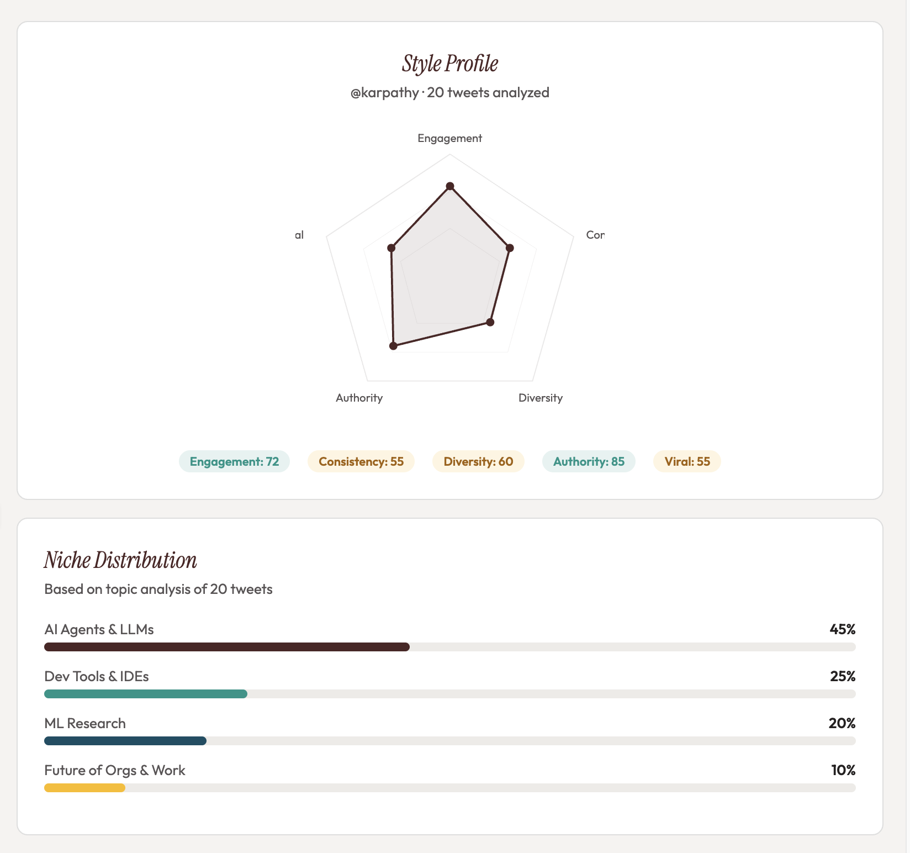
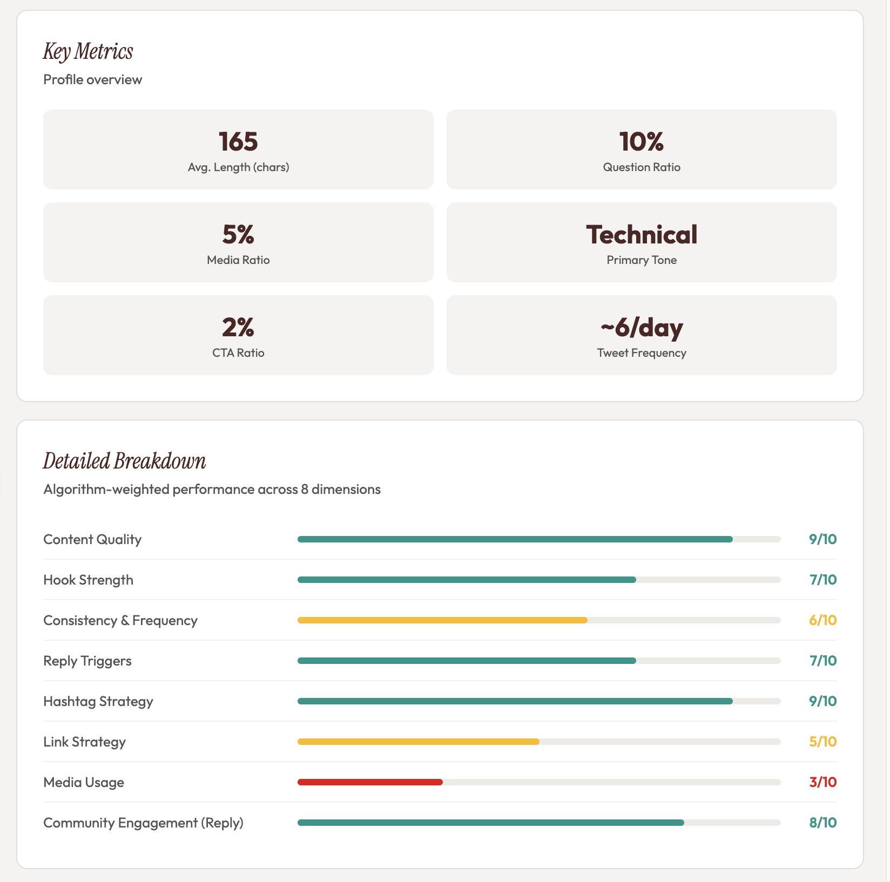
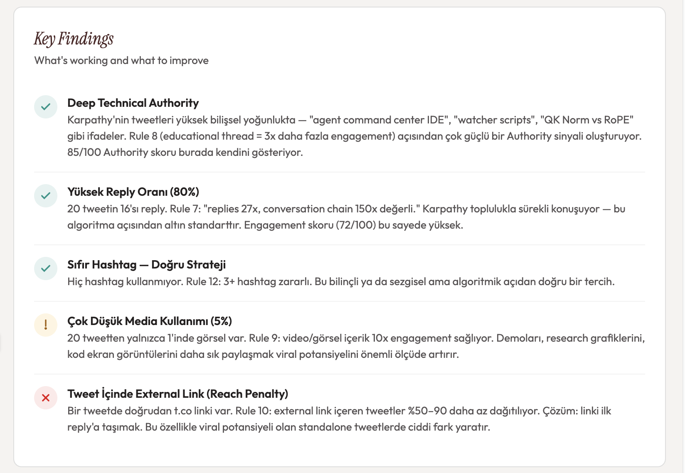
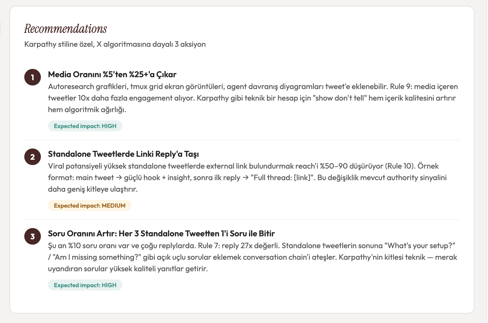

<p align="center">
  
</p>

<h1 align="center">X Algorithm Advisor</h1>

<p align="center">
  <strong>Claude plugin that turns X algorithm knowledge into action.</strong><br/>
  Analyzes your writing style, generates optimized tweets, scores them, and posts — all through conversational AI.
</p>

<p align="center">
  <a href="https://xquik.com">Powered by xquik</a> ·
  <a href="#installation">Install</a> ·
  <a href="#commands">Commands</a> ·
  <a href="#how-it-works">How it works</a>
</p>

---

## Screenshots

<p align="center">
  
</p>

<p align="center">
  
</p>

<p align="center">
  
</p>

<p align="center">
  
</p>

---

## What it does

| Capability | Description |
|------------|-------------|
| **Style Analysis** | Analyzes any X account — detects niche, tone, writing patterns, and scores across 5 dimensions |
| **Tweet Generation** | Produces 3 algorithm-optimized alternatives for any topic, matching your personal style |
| **Thread Builder** | Creates hook → body → CTA threads with per-tweet scoring |
| **Tweet Scoring** | Evaluates any tweet against 16 algorithm rules with a visual breakdown |
| **Trend Radar** | Surfaces trending topics filtered by your niche |
| **Style Comparison** | Side-by-side comparison with any account |
| **Smart Posting** | Posts with approval, handles threads via reply chains, auto-moves links to first reply |
| **Profile Memory** | Remembers your style across sessions — no re-analysis needed |

Everything is backed by real algorithm data from [X's open-source ranking algorithm](https://github.com/twitter/the-algorithm) and xquik's real-time API.

## Installation

### Claude Code

```bash
claude plugin add github:cberktavsan/x-advisor
```

Then run `/x-advisor` — the plugin will guide you through connecting xquik automatically (opens your browser, you paste the API key, done).

### Claude Desktop

1. Add the plugin from the local directory or marketplace
2. Run `/x-advisor` — the setup wizard handles everything

### Manual MCP Setup (optional)

If you prefer to set up xquik manually:

```bash
claude mcp add xquik --transport http --url https://xquik.com/mcp --header "x-api-key: YOUR_API_KEY"
```

Get your API key at [xquik.com/dashboard/api-keys](https://xquik.com/dashboard/api-keys) (free account at [xquik.com/register](https://xquik.com/register)).

### Free Tier

The free tier covers style analysis, tweet composition, scoring, and trends. An optional subscription unlocks tweet posting, engagement metrics, and profile data.

## Commands

### `/x-advisor`

The full guided wizard. Walks you through account analysis, goal setting, niche confirmation, visual reports, and action selection.

```
/x-advisor              # Full wizard
/x-advisor acmedev   # Skip to analysis for a specific user
```

### `/x-tweet`

Generate a tweet or thread on any topic. Loads your saved style profile automatically.

```
/x-tweet AI agents are replacing SaaS
/x-tweet                                # Asks for topic
```

### `/x-score`

Score any tweet text against the algorithm. Shows a gauge meter + 8-dimension breakdown with specific improvement tips.

```
/x-score The future of AI is autonomous agents that can reason, plan, and execute.
```

### `/x-style`

Analyze any X account's writing style. Shows radar chart, niche distribution, key metrics, detailed findings, and recommendations.

```
/x-style @elonmusk
/x-style acmedev
```

### `/x-trends`

View trending topics from the xquik radar. Highlights trends matching your niche and offers to write a tweet about them.

```
/x-trends
/x-trends tech
```

## How it works

### Algorithm Knowledge

The plugin embeds 16 rules from X's ranking algorithm:

| Signal | Weight | Insight |
|--------|--------|---------|
| Reply | **27x** | Most valuable signal. Every tweet should trigger replies. |
| Quote tweet | 25x | High-value signal for authority building. |
| Retweet | 20x | Shareability matters — lists, insights, and threads get RT'd. |
| Profile visit | 12x | Strong hook → profile click → follow. |
| Video view | 10x | 2s+ watch counts. Video content has massive reach potential. |
| Like | 1x | Baseline signal. Necessary but not sufficient. |

Plus: link penalties (50-90% drop), golden hour mechanics, hashtag myths, Premium boost, consistency rewards, and more. Full rules in [`algorithm-rules.md`](skills/x-algorithm/references/algorithm-rules.md).

### Style Profile Persistence

After your first analysis, the plugin saves your profile to `.claude/x-algorithm-advisor.local.md`:

```yaml
username: "acmedev"
niche: ["Technology", "AI", "Finance"]
tone: "technical-casual"
language: "en"
goal: "engagement"
radar:
  engagement: 45
  consistency: 55
  diversity: 65
  authority: 60
  viral: 30
```

Subsequent sessions load this instantly — no re-analysis needed. Profile refreshes automatically after 7 days.

### Visual Reports

All charts render as artifacts in Claude Desktop using the [xquik design system](https://xquik.com):

- **Radar Chart** — 5-dimension style profile (Engagement, Consistency, Diversity, Authority, Viral)
- **Bar Chart** — Niche/topic distribution
- **Gauge Meter** — Tweet score with color-coded thresholds
- **Breakdown Bars** — 8-dimension scoring detail
- **Comparison Table** — Side-by-side account metrics
- **Thread Summary** — Per-tweet score card

### Freemium Model

| Feature | Free | Subscription |
|---------|:----:|:------------:|
| Style analysis | ✅ | ✅ |
| Tweet generation | ✅ | ✅ |
| Tweet scoring | ✅ | ✅ |
| Trend radar | ✅ | ✅ |
| Drafts | ✅ | ✅ |
| Style comparison | ✅ | ✅ |
| Tweet posting | — | ✅ |
| Engagement metrics | — | ✅ |
| Profile data | — | ✅ |
| X trending topics | — | ✅ |

If a paid feature is requested without a subscription, the plugin provides a checkout link and continues with free features — it never blocks the session.

## Architecture

```
x-advisor/
├── .claude-plugin/
│   └── plugin.json                     # Plugin metadata (v1.0.0)
├── .mcp.json                           # xquik MCP config (HTTP + OAuth)
│
├── commands/                           # User-invoked slash commands
│   ├── x-advisor.md                    # Full wizard with guided flow
│   ├── x-tweet.md                      # Direct tweet/thread generation
│   ├── x-score.md                      # Quick tweet scoring
│   ├── x-style.md                      # Account style analysis
│   └── x-trends.md                     # Trending topic discovery
│
├── agents/                             # Specialized sub-agents
│   ├── style-analyst.md                # Deep style analysis & radar scoring
│   ├── tweet-writer.md                 # Creative tweet generation (3 alts)
│   └── score-evaluator.md              # Scoring & artifact visualization
│
├── skills/
│   └── x-algorithm/
│       ├── SKILL.md                    # Auto-triggers on X/Twitter topics
│       ├── examples/
│       │   └── sample-interactions.md  # 3 example conversations
│       └── references/
│           ├── algorithm-rules.md      # 16 algorithm rules + strategy matrix
│           ├── xquik-api.md            # Full API endpoint reference
│           ├── call-rules.md           # API ordering & 402 handling
│           ├── style-analysis.md       # Analysis flow + radar formulas
│           ├── tweet-generation.md     # Composition flow + 10-point checklist
│           ├── scoring-visuals.md      # 6 HTML/SVG artifact templates
│           ├── tweet-posting.md        # Posting, threading, link management
│           ├── user-profile.md         # Profile persistence spec
│           └── language-edge-cases.md  # Multi-language + edge cases
│
├── hooks/
│   └── hooks.json                      # SessionStart MCP connectivity check
│
├── LICENSE                             # MIT
└── .gitignore
```

## Contributing

1. Fork the repo
2. Create a feature branch (`git checkout -b feature/my-feature`)
3. Make your changes
4. Test locally: `claude --plugin-dir /path/to/x-advisor`
5. Reload without restarting: `/reload-plugins`
6. Submit a pull request

### Local Development

```bash
git clone https://github.com/xquik/x-advisor.git
cd x-advisor
claude --plugin-dir .
```

Use `/reload-plugins` in Claude Code to pick up changes without restarting.

## License

MIT — see [LICENSE](LICENSE) for details.

---

<p align="center">
  Built by <a href="https://xquik.com">xquik</a> · Real-time X data platform
</p>
